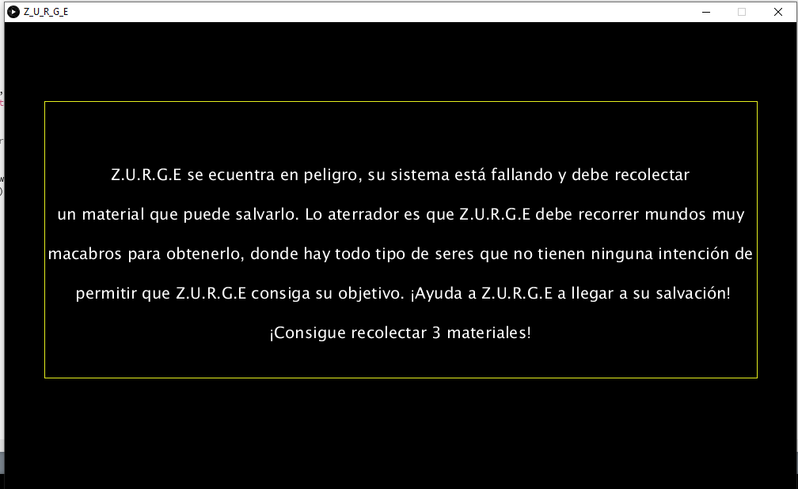
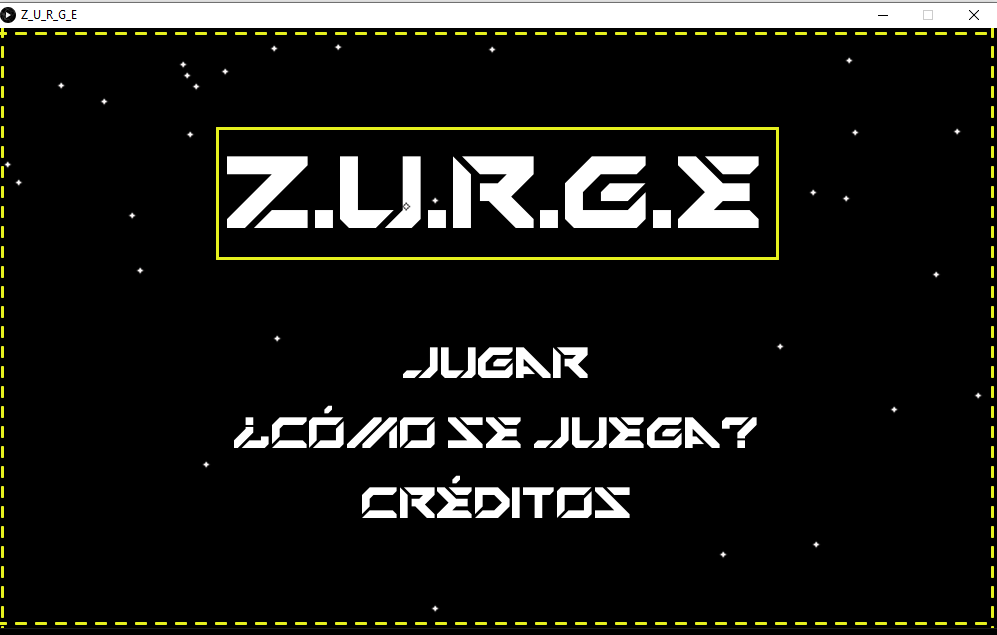
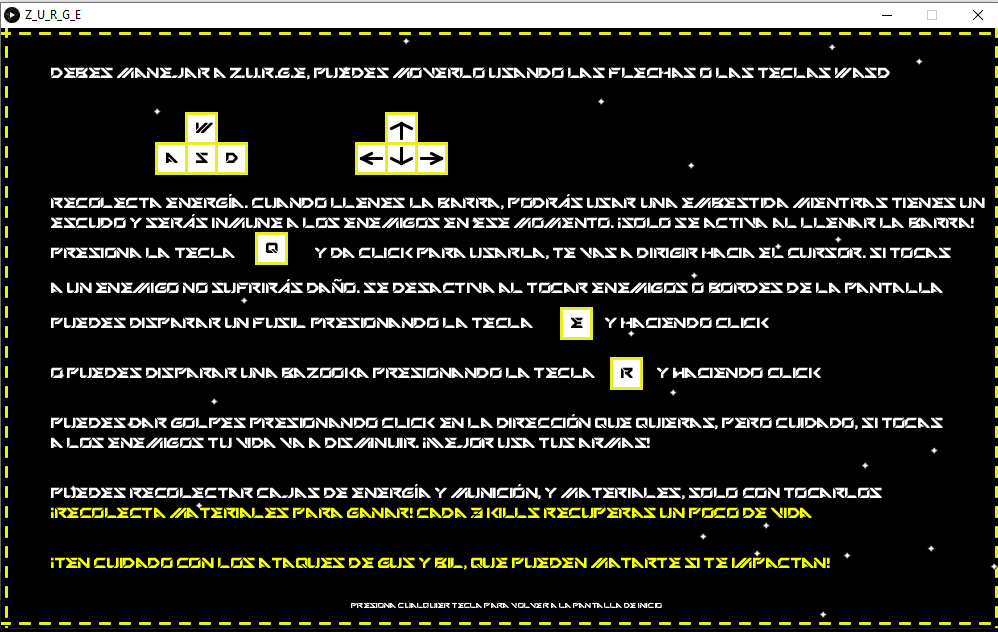

Z.U.R.G.E 
================

**Juego de rol en el que debes ayudar a Z.U.R.G.E a recolectar materiales necesarios para su salvación.**

`Z.U.R.G.E` is a **private** project based on **Defender** by Williams Electronics.

**Autores**
- Andrés Fernando Jerez Medina 2190416
- Miguel Aim Garcia Villamizar 2190426

### Features

- Es un juego de rol, en el que la historia desarrollará una parte de la vida de Z.U.R.G.E, nuestro personaje principal. Es un juego de un jugador.
- Encontrarás al iniciar el juego una introducción a la historia, en donde se narra el problema y se describe tu misión a cumplir. ¡Ayuda a Z.U.R.G.E a salvarse!
- En el menú principal encontrarás 3 opciones. Jugar, ¿Cómo jugar? y Créditos. Dando click encima de estas opciones te dirigirás a cada una de ellas. En ¿Cómo jugar?, encontrarás las instrucciones y los controles, y en Créditos, las referencias a los autores del contenido usado.
- En la fase de juego encontrarás diferentes marcadores: En la esquina superior izquierda, la cantidad de materiales que llevas. En la esquina superior derecha, las bajas que llevas. Y en la parte inferior estarán las barras de Vida, Energía y Munición.
- Recolecta las cajas que salen del borde derecho de la pantalla para ir aumentando tu energía y munición. Y esquiva los ataques de los enemigos para no perder vida.
- ¡Juega e intenta recolectar los materiales necesarios para salvar al buen robot Z.U.R.G.E!
- Desarrollado y programado en Processing

Table of Contents
-----------------

1. Inicia el juego: Para empezar, se imprimirá en pantalla la historia o guion que sigue el juego, te contextualizará acerca de tu objetivo. Luego estarás en el menú, donde tendrás las 3 opciones de: Jugar, ¿Cómo jugar? y Créditos. Dale a ¿Cómo jugar? y mira los controles y las instrucciones de juego, una vez hecho ya estarás listo para jugar. Si quieres ver las referencias de contenido ingresa en Créditos. Dale click a Jugar. Iniciarás la aventura, ten cuidado con los aliens que serán los primeros enemigos que encuentres en tu trayecto. Elimínalos y avanza. Cuando llegues a **** kills te enfrentarás al primer jefe, GUS, un ser de otro planeta a quien no le agrada mucho verte. Esquiva sus ataques con mucho cuidado, es muy veloz, y elimínalo. Una vez hayas derrotado a GUS, habrás pasado el primer nivel del juego. Ahora ponte las pilas, que viene lo duro. Empezará el segundo nivel, y ahora enfrentarás tanto a aliens como a individuos de la especie de GUS, ¡al mismo tiempo! . Esquiva los ataques y el contacto, y elimínalos. Ahora juega e intenta superar a tus enemigos, ten cuidado, lanzan poderes y armas que te pueden eliminar! Al llegar a *** kills, será hora de tu prueba final. Enfrentarás a BIL, el jefe final del jeugo. Bil es un ser que puede parecerte más debil o inofensivo que GUS, pero no ten confíes, BIL es capaz de dispararte orbes que te hacen un daño inmenso. Y ni intentes tocarlo cuerpo a cuerpo, o morirás directamente.Y listo, si lográs eliminar a Bill habrás recolectado todo el material que necesitaba Z.U.R.G.E. ¡Felicidades, ganaste!
3. [Google Drive Folder](https://drive.google.com/drive/u/0/folders/1aHus9c-BhTCQxW1XMB5bADENxPvwtL3g)

ToDo
----

- Puedes echarle un vistazo a ejemplos muy buenos para desarrollar en Processing, en la página de processing.org 
- El canal de Youtube "The Coding Train" fue de gran ayuda para comprender algunos conceptos de la plataforma.
- El libro de "Getting Started With Processing" de A Hands-O - Casey Reas fue muy útil para el desarrollo del juego.

**¿Qué te pareció?, ¿Pudiste conseguir la victoria? Esperamos te haya gustado :D**
